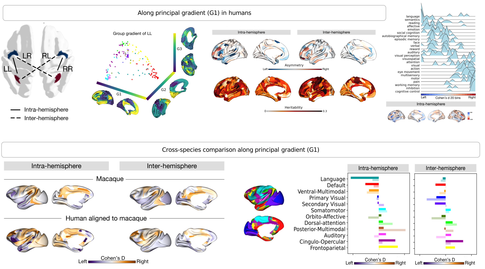

# **Asymmetry of functional organization in humans and macaques**

### Here I'd like to introduce the repo for the preprint [Asymmetry of cortical functional hierarchy in humans and macaques suggests phylogenetic conservation and adaptation](https://www.biorxiv.org/content/10.1101/2021.11.03.466058v1.abstract).

---
## **Scripts**
**1. Gradients in humans**
- `p01_ts_glasser_fc.py` summarizes the BOLD signal to the Glasser parcellation (180 parcels per hemisphere) and computes the individual functional connectivity (FC) matrix.
- `p02_fc2aligngrad2corrected.py` gets the individual gradients of FC matrix, and alignes/correctes the individual gradients to the template based of group-level LL FC matrix using Procrustes rotations.
- `results_fig1.ipynb` visualizes the gradients of each FC pattern (LL, RR, LR, and RL).

**2. Asymmetry of gradients and its heritability in humans**
- `p03_grad2heritablity.py` prepares the phenotypical files for the heritability analyses with SOLAR.
- `s00_HowToRun_solar.txt` introduces how to run the analyses.
- `s01_solar_run.sh`,   
`s02_solar_run_herit.sh`,  
`s03_solar_run_assemble_herit.sh`  
extract the heritablity score of each parcel (based on bash).
- `results_fig2and3.ipynb` visualizes the asymmetry of gradients and its heritability in humans.
- `results_fig5.ipynb` visualizes the functional decoding of the 24 terms along the intra-hemispheric asymmetry axis.

**3. Asymmetry of gradients in macaques** 
- `p04_macaque.py` extracts the individual gradients of FC matrix in macaques, using the same method as analyses of figure 1 (using human data)
- `results_fig4.ipynb` visualizes the asymmetry of gradients in macaques and provides a network-wise comparison between macaques and humans.

**4. Supplements**
- `p05_supplement_Norm_DK.py` and `p06_supplement_UKB.py` provides the replication results of using normalization formula (left-right)/(left+right), Desikan-Killiany Atlas, and UKB.
- `p07_rr_alignment.py` aligns individual gradients to another template of gradients of group-level RR FC matrix.
- `p08_unalignment.py`and `p_09_same_model.py`  verifies the Procrustes alignment approach by comparing it to gradients without alignment and left-right normalisation.
- `results_supplements_1.ipynb` visualizes individual gradients (**Fig1-supp2**), the results of G2 and G3 (**Fig3-supp1**), parcel-wise comparison between macaques and humans(**Fig4-supp1**), and function decoding along the inter-hemispheric asymmetry axis (**Fig5-supp1**).
- `results_supplements_2.ipynb` visualizes Cohen's d in humans (**Fig2-supp2**), normalization formula (**Fig2-supp3**), DK atlas (**Fig2-supp4**), and UKB replication (**Fig2-supp5**).
- `results_supplements_3.ipynb` visualizes asymmetry results including results of G4-10(**Fig1-supp1**), averaging the left and right alignment in macaques(**Fig4**), vertex-wise asymmetry(**Fig2-supp6**), and RR alignment in humans (**Fig2-supp10**).
- `results_supplements_4.ipynb` visualizes figures of unalignment (**Fig2-supp7** and **Fig2-supp8**), using same embedding model (**Fig2-supp9**), and top 10% FC profiles of the most asymmetric region (**Fig2-supp1**).

## **Data**
- Human data are from Human Connectome Project [(HCP)](https://db.humanconnectome.org/) S1200 release and [UK Biobank](https://www.ukbiobank.ac.uk/).
- Macaque data are from [PRIMATE-DE](http://fcon_1000.projects.nitrc.org/indi/indiPRIME.html) (site: Oxford).
- NeuroSynth 24-terms functional maps are included under the 'data/metaanalysis/'

## **Key dependencies**
- [**Python 3.8**](https://www.python.org/downloads/release/python-380/)
- [**BrainSpace**](https://brainspace.readthedocs.io/en/latest/index.html)
- [**SOLAR**](www.solar-eclipse-genetics.org)
- [**NeuroSynth**](https://neurosynth.org/)

---
## **Support**
Feel free to get in touch if you have any questions (binwan@cbs.mpg.de)
